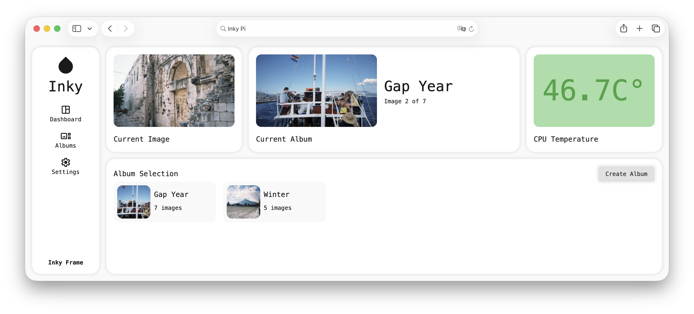

<div align="center">

# Inky Frame

</div>

A self-hosted smart picture frame powered by a RaspberryPi with a full stack web management system



<div align="center">


</div>

## Overview

The **Inky Frame** combines a RaspberryPi and a 7 color e-ink display to create a connected picture frame you control on a browser. Organize images, create albums and control the onscreen image instantly, all on a web dashboard hosted locally on the RaspberryPi.

## Features

| Features                  | Description                                          |
| ------------------------- | ---------------------------------------------------- |
| **Web Dashboard**         | Control the Inky Frame on a locally hosted dashboard |
| **Random Image Rotation** | See a new image every day                            |
| **Album Management**      | Organize fitting images into collections             |
| **Cloud Image Storage**   | Store more images with cloudinary integration        |
| **Hardware Monitoring**   | Monitor RaspberryPi from the dashboard               |

## Tech Stack

| Layer      | Technology                                              |
| ---------- | ------------------------------------------------------- |
| Frontend   | React 19, Vite 7, React Router 7, CSS Modules           |
| Backend    | Node.js 18, Express 5, Prisma ORM, PostgreSQL, Multer 2 |
| Storage    | Cloudinary                                              |
| Hardware   | Raspberry Pi Zero 2 W, Waveshare 7.3" 7-color E-ink     |
| Pi Scripts | Python 3, Pillow, Waveshare EPD driver                  |

## Hardware Requirements

- [Raspberry Pi Zero 2 W](https://www.raspberrypi.com/products/raspberry-pi-zero-2-w/)
- [7.3inch ACeP 7-Color E-Paper E-Ink Display Module, 800×480 Pixels, SPI Communication](https://www.waveshare.com/product/displays/e-paper/epaper-1/7.3inch-e-paper-hat-f.htm)
- 32GB+ SD card
- Micro USB power supply

## Getting Started

### Prerequisites

- NodeJS 18+, npm
- PostgreSQL 12+
- Python 3.7+

### Backend

```bash
cd backend
npm install
npx prisma migrate deploy
touch .env
```

**.env**

```bash
# Database
DATABASE_URL="[link_to_postgres_database]"

# Cloudinary
CLOUDINARY_CLOUD_NAME=[your_cloud_name]
CLOUDINARY_API_KEY=[your_api_key]
CLOUDINARY_SECRET_KEY=[your_secret_key]

# Frontend link
FRONTEND_URL=http://[pi_ip_address]:4173
```

### Frontend

```bash
cd frontend
npm install
npm run build
touch .env
```

**.env**

```bash
VITE_API_URL=http://[pi_ip_address]:3000
VITE_ALLOWED_HOSTS=[pi_ip_address]
```
